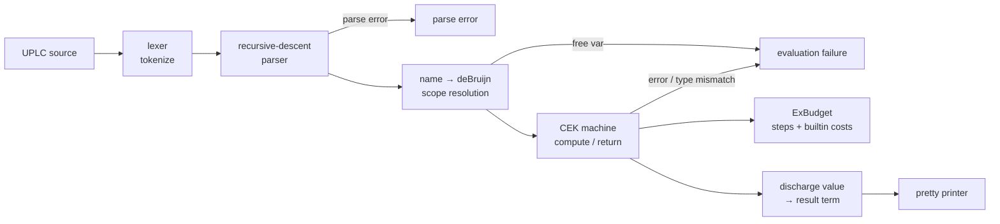
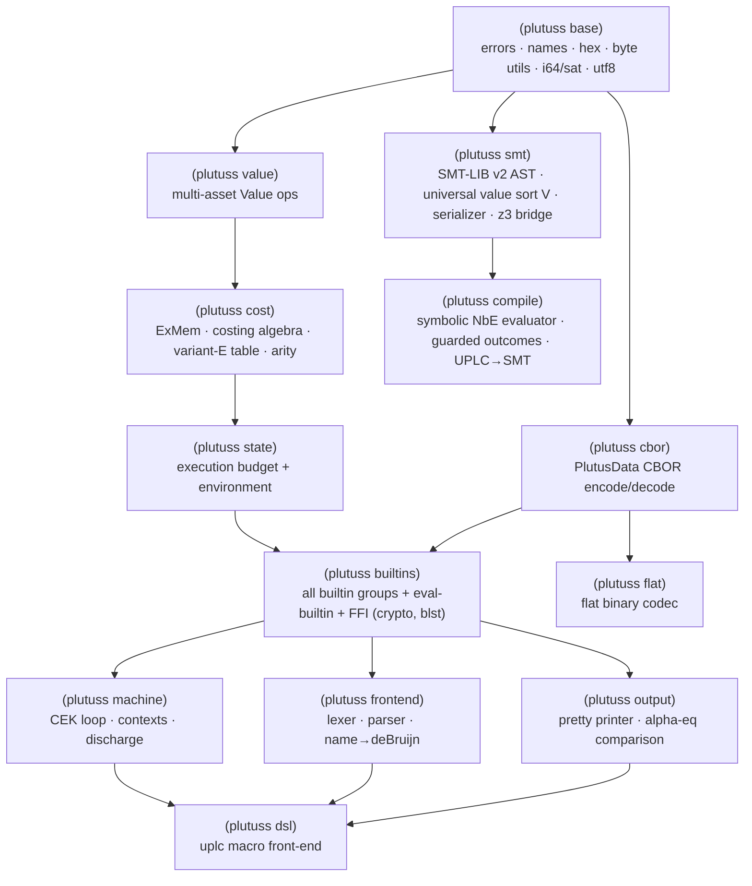

# plutuss

A [UPLC](https://github.com/IntersectMBO/plutus) (Untyped Plutus Core) CEK machine
implemented in **Chez Scheme**, structurally equivalent to the Zig reference
[`utxo-company/plutuz`](https://github.com/utxo-company/plutuz).

It is a parser, CEK-machine evaluator, exact cost-model accountant, and pretty
printer for UPLC. It passes the **entire** IntersectMBO
[`plutus-conformance`](https://github.com/IntersectMBO/plutus/tree/master/plutus-conformance)
UPLC evaluation suite — **999/999 tests on both the result term (alpha-equivalence)
and the exact execution budget** (cpu + memory).

## Results

```
TOTAL=999  result-pass=999  full-pass(result+budget)=999
```

- 449 success tests — output term matches up to alpha-equivalence, and consumed
  `cpu`/`mem` match the golden budget exactly.
- 440 `evaluation failure` tests — evaluation fails as expected.
- 110 `parse error` tests — input is rejected at parse time as expected.

The cost model is the Cardano **cost-model variant E** (`DefaultFunSemanticsVariantE`),
which is what `defaultCostModelParamsForTesting` selects and what the conformance
budget golden files were generated with. The full builtin cost table
(`src/plutuss/cost-table.ss`, used by `(plutuss cost)`) is auto-generated
verbatim from `builtinCostModelE.json`.

## Requirements

- [Chez Scheme](https://cisco.github.io/ChezScheme/) 10.x
- `libsodium`, `openssl@3`, `secp256k1` (Homebrew on macOS) — for SHA-256, BLAKE2b,
  Ed25519, ECDSA/Schnorr secp256k1
- `blst` — built locally by `./build-blst.sh` (for BLS12-381)

Crypto strategy: full native FFI to `libsodium` (SHA-256, BLAKE2b, Ed25519),
`libsecp256k1` (ECDSA + Schnorr), and `blst` (all BLS12-381 G1/G2/pairing ops).
`keccak-256`, `sha3-256`, and `ripemd-160` are pure-Scheme (no clean library
exposes Ethereum-padding Keccak or OpenSSL-3-legacy RIPEMD-160 without provider
juggling).

## Build & run

```sh
./build-blst.sh                          # build blst/libblst.dylib once

# Evaluate a program (prints the result, or `evaluation failure` / `parse error`)
chez --script plutuss.ss program.uplc
chez --script plutuss.ss -b program.uplc   # also print consumed budget
chez --script plutuss.ss -p program.uplc   # pretty-print only, no eval

# Flat (binary on-chain) codec
chez --script plutuss.ss -f program.uplc   # encode to flat, print as hex
chez --script plutuss.ss -u script.flat    # decode a .flat file to textual UPLC

# Run the full conformance suite (expects the plutus repo cloned at ./plutus)
git clone --depth 1 https://github.com/intersectMBO/plutus.git
chez --script tools/conf.ss                  # 999/999
chez --script tools/conf.ss /builtin/semantics/addInteger   # a subset
```

## Syntax DSL (build ASTs from Scheme, no string parsing)

`(plutuss dsl)` is a macro front-end: where `(plutuss frontend)` tokenizes and parses a
*string*, the `uplc` macro builds the very same named AST directly from
s-expression syntax at macro-expansion time. UPLC's textual grammar is already
list-shaped, so it maps almost 1:1 (and Chez reads `[f a]` as `(f a)`, so the
application brackets work verbatim):

```scheme
(uplc (lam x [ [ (builtin addInteger) x ] (con integer 1) ]))   ; build a named AST

;; uplc-eval / uplc-run are FUNCTIONS over a built term:
(uplc-eval (uplc [ [ (builtin addInteger) (con integer 2) ]
                   [ [ (builtin multiplyInteger) (con integer 3) ] (con integer 4) ] ]))
;; => #(con (int 14))   (evaluates via the CEK machine)

;; build once, evaluate the value:
(define applyadd1 (uplc [ (builtin addInteger) (con integer 1) (con integer 2) ]))
(uplc-eval applyadd1)        ; => #(con (int 3))
(uplc-run  applyadd1)        ; => "(program 1.1.0 (con integer 3))"
```

Because it's a macro, constant values and `constr` tags can be arbitrary Scheme
expressions; `,e` splices a Scheme-built sub-term, and `,@e` splices a Scheme
list of terms into the list-shaped positions (`case` branches, `constr` fields,
application arguments — and `List`/`Map`/`Constr` data elements):

```scheme
(uplc (con integer (* 6 7)))                       ; 42
(uplc (con data (Constr 0 (I 1) (B (hex "ab")))))  ; data literals
(uplc (con (pair integer bool) (42 #t)))           ; pair / list constants
(let ((t (uplc (con integer 42)))) (uplc [ (lam x x) ,t ]))
(let ((branches (list (uplc (lam x x)))))
  (uplc (case (constr 0 (con integer 7)) ,@branches)))
(uplc (con data (Constr 0 ,@(map (lambda (n) (list 'I n)) '(1 2 3)))))
(uplc (lam ,(gensym->unique-string (gensym)) (con unit ())))  ; computed binder name
```

Entry points: `(uplc term)`, `(uplc-program (maj min pat) term)`, `(uplc-eval term)`,
`(uplc-run term)`. Every construct produces an AST alpha-equivalent to the
string parser's output, so it feeds the same `name->debruijn` + CEK pipeline.

## Symbolic execution: UPLC → SMT (z3-backed verification)

`(plutuss compile)` is a **denotational compiler** from UPLC to SMT-LIB, and
`(plutuss smt)` is its target. Together they let you *prove* facts about a
validator for **all** inputs (or *find* an input meeting a goal), instead of
evaluating it on one concrete input.

`(plutuss smt)` is a small SMT-LIB v2 AST whose centrepiece is a **universal
value sort `Val`** — one datatype covering every first-order UPLC value
(`VInt`/`VBytes`/`VString`/`VBool`/`VUnit`/`VData`/`VList`/`VDataList`/
`VPairDataList`/`VPair`/`VPairData`/`VArray`/`VConstr`/BLS elements).
ByteStrings are `Bytes = (Seq Int)` with a `bytes_valid` well-formedness
predicate; Plutus `Data` is the sort `Data`, and builtin lists are datatypes
(`ValList`/`DataList`/`DataPairList`) so head/tail/null/chooseList are native
selectors. Higher-order values (closures, thunks, partial builtins) are not in
`Val` — the compiler keeps them structural at Scheme-eval time.

`(plutuss compile)` is a fuel-bounded **normalisation-by-evaluation** interpreter
— a structural clone of the big-step CEK evaluator — over the symbolic value
domain `SymVal`. Its result is a list of guarded outcomes:

* `ok pc value` — the term returns `value` under path condition `pc`.
* `error pc` — the precise UPLC error condition: type mismatch, division by
  zero, head-of-nil, out-of-range tag, and so on.
* `timeout pc` — the fuel bound was exhausted on that path.

Because outcomes are path-conditioned, one compiled result describes the whole
input space at once. Lazy symbolic branches are kept as separate guarded
outcomes, and branching on symbolic data becomes SMT conditions over those
outcomes rather than a Scheme-level fork.

It is a faithful Scheme port of the Lean development
[`utxo-company/moist`](https://github.com/utxo-company/moist)
(`Moist/SMT/Basic.lean` and `Moist/SMT/UPLC.lean`): `eval-sym`/`apply-sym`/
`force-sym`/`case-sym` mirror the machine transitions one-for-one, closures are
defunctionalized exactly as the CEK does (they never appear in the emitted SMT),
and unbounded recursion is handled by `fuel`.

```scheme
(import (chezscheme))
(library-directories (list "src"))
(import (plutuss smt) (plutuss compile))            ; FFI-free: no native crypto

;; Build UPLC terms directly (de Bruijn; Var 1 = the first symbolic input).
(define (intC n)   (vector 'con (cons 'integer n)))
(define (b2 op x y)(vector 'app (vector 'app (vector 'builtin op) x) y))

;; validator  0 <= x*x  (one symbolic integer input, x = Var 1)
(define validator
  (b2 'lessThanEqualsInteger (intC 0) (b2 'multiplyInteger (vector 'var 1) (vector 'var 1))))
(define c (uplc-symbolic-compile 10 (list (cons "x" 'integer)) validator))

;; prove it for ALL x by refuting "it returns false":
(z3-check (compiled->smtlib c (lambda (r) (goal-returns-bool r #f))))   ; => unsat

;; or solve for a witness — find x with  equalsInteger 10 (addInteger 5 x) = true:
(define c2 (uplc-symbolic-compile 10 (list (cons "x" 'integer))
             (b2 'equalsInteger (intC 10) (b2 'addInteger (intC 5) (vector 'var 1)))))
(z3-check (compiled->smtlib c2 (lambda (r) (goal-returns-bool r #t))))  ; => sat  (x = 5)
```

`uplc-symbolic-compile fuel inputs term` returns a compiled result; a **goal**
maps that result to SMT assertions, and `compiled->smtlib` emits the runnable
script. The goal builders are `goal-returns-bool`/`goal-returns-int`/
`goal-equals-v` (the value equals a target), `goal-succeeds`/`goal-errors`,
and `goal-indeterminate` (fuel timeout). `z3-check` returns `'sat` (a witness —
recover the model with `z3-model`/`run-z3`), `'unsat` (no such input), or
`'unknown`. Scripts mirror Moist: unlabelled assertions, `(check-sat)`, and
`(get-model)`.

**Builtin coverage.** Precise SMT for integer ops (incl. floor/trunc div & mod),
bytestring ops including slicing, lexicographic comparison and indexing, string
ops, `ifThenElse`/`chooseUnit`/`trace`, pairs, lists, arrays, `Data`
constructors/destructors, value builtins, bitwise bytestring builtins,
`integerToByteString`/`byteStringToInteger`, `expModInteger`, hashes,
signatures, and BLS operations. Operations without native SMT definitions are
represented with uninterpreted functions plus the same guard/error conditions as
the current Moist model. Constant literals are first-order too
(`Integer`/`Bool`/`ByteString`/`String`/`Unit`/`Data` and list/pair/array
flavours), so they compose with symbolic builtins. Lambda, delay, force, apply,
`constr`, and `case` are supported; `case` dispatches on symbolic
`Bool`/`Integer`/list/pair/constr scrutinees by guarded outcomes.

**Partiality** is carried in `err`, never as a partial meaning, so the divide
builtins contribute `y = 0` to `err` and `(x*y)/y = x` is provable only once
`y ≠ 0` is assumed.

**Bounded recursion.** A recursive validator (built with the Z combinator)
unrolls up to the fuel budget. Within the unrolled depth, z3 can prove or refute
the requested property; beyond it the result contains `timeout` outcomes, so
`goal-indeterminate` can be used to ask whether some input is beyond the current
horizon. More fuel gives a deeper frontier. `prove-sum.ss` also shows the usual
induction pattern: abstract the recursive call as a symbolic input carrying the
induction hypothesis, then prove the one-step body for all inputs.

A builtin is identified by its UPLC name. A `(builtin desc)` node may carry a
real `(plutuss builtins)` descriptor (from the parser/`uplc` DSL, read via record
reflection) or a plain name string/symbol (for FFI-free programmatic use); both
work. Because it needs none of the native-crypto builtins, `(plutuss compile)`
imports neither `(plutuss builtins)` nor any FFI — it runs anywhere z3 is on
`PATH`.

### Examples & tools

```sh
chez --script example-symbolic.ss          # the worked suite (ported from moist's
chez --script example-symbolic.ss --emit   #   Test/Symbolic/Examples.lean), 15 cases
chez --script example-advanced-symbolic.ss # richer examples: Data, arrays, dynamic Val,
                                           #   bytestring constraints, hash congruence
chez --script prove-sum.ss                 # bounded model checking + an unbounded
                                           #   proof by induction (forall x. sum x >= 0)
chez --script example-find.ss              # higher-order recursive `find` over SOP
                                           #   List/Maybe, proved for ALL inputs

chez --script tools/z3.ss --demo           # a few example validators -> z3
chez --script tools/z3.ss --smt2 query.smt2  # run z3 on a raw SMT-LIB file
```

All of the above build UPLC terms directly (no parser/DSL), so they stay
FFI-free and run anywhere z3 is installed.

## Flat (binary) codec

`(plutuss flat)` implements the bit-level **flat** serialization defined by the
Plutus Core specification — the on-chain encoding for Plutus scripts. It encodes
de-Bruijn programs MSB-first: 7-bit-chunked naturals, zigzag-encoded integers,
byte-aligned 255-byte-chunked byte arrays, 4-bit term tags, 7-bit builtin tags,
bit-prefixed type-tag/term lists, and a `0…01` filler. `data` constants are
nested CBOR (`serialiseData`-compatible encode + a full PlutusData CBOR decoder).

It is validated three ways:

- The reference byte vectors (`(error)` → `01000061`, `(con unit ())` →
  `0100004981`, `(builtin addInteger)` → `0100007001`, `(con integer 42)` →
  `010000481501`) all match.
- **All 78 real Cardano mainnet `.flat` scripts** bundled with plutuz decode and
  **re-encode byte-for-byte identically**.
- Every flat-serialisable conformance program round-trips
  `text → deBruijn → flat → deBruijn` up to alpha-equivalence (763/763; the rest
  hold non-serialisable constant types — BLS elements, arrays, Values — which the
  reference encoder rejects too). Zero codec mismatches.

## Pipeline



The runner `tools/conf.ss` replicates the official `compareAlphaEq`: it parses
both the produced and expected programs to de-Bruijn terms and compares
structurally (ignoring binder names), and compares the budget exactly.

## Module structure

The implementation is a set of R6RS libraries under `src/plutuss/`, with an
aggregate `(plutuss)` (`src/plutuss.ss`) that re-exports the public API.
There is no `(load …)`: callers set the library directory and import:

```scheme
(import (chezscheme))
(library-directories (list "src"))
(import (plutuss))        ; or import individual sub-libraries
```



The builtin groups (arithmetic/bytestring/string/list, data, bitwise, value,
crypto, BLS) live inside `(plutuss builtins)` so they share helpers without a
mutable global dispatcher; `eval-builtin` composes them with explicit `or`.

`(plutuss smt)` and `(plutuss compile)` form a self-contained, FFI-free
verification stack that depends only on `(plutuss base)`: the symbolic compiler
identifies builtins by name (reading a real descriptor's name/arity/forces by
record reflection when one is present), so it never imports the native-crypto
`(plutuss builtins)`. They are also re-exported from the `(plutuss)` aggregate.

## Notes on tricky conformance details

- **Cost model = variant E.** Several builtins differ from older variants — e.g.
  `divideInteger`/`modInteger` use `above_and_below_diagonal` with `c11=960`, and
  the Value builtins have distinct params. The whole table is generated from the
  JSON so it stays exact.
- **String size measure.** Cost-relevant string arguments use
  `TextCostedByByteLength`: the size is `utf8_byte_length quot 4`, not character or
  byte count.
- **`shiftByteString` / `rotateByteString`** fail (evaluation failure) when the
  shift amount does not fit in a signed `Int64`.
- **BLS scalars** for `scalarMul` / `multiScalarMul` are bounded to 4096 bits
  (64 words); out-of-range scalars are an evaluation failure.
- **`unValueData`** strictly validates sorted, non-zero, non-empty, ≤32-byte keys.
- **Budget arithmetic** uses saturating i64 ops; the consumed budget is clamped to
  `maxBound :: Int64` per dimension, matching the reference.
```
