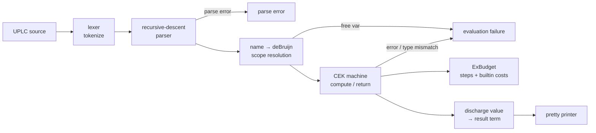
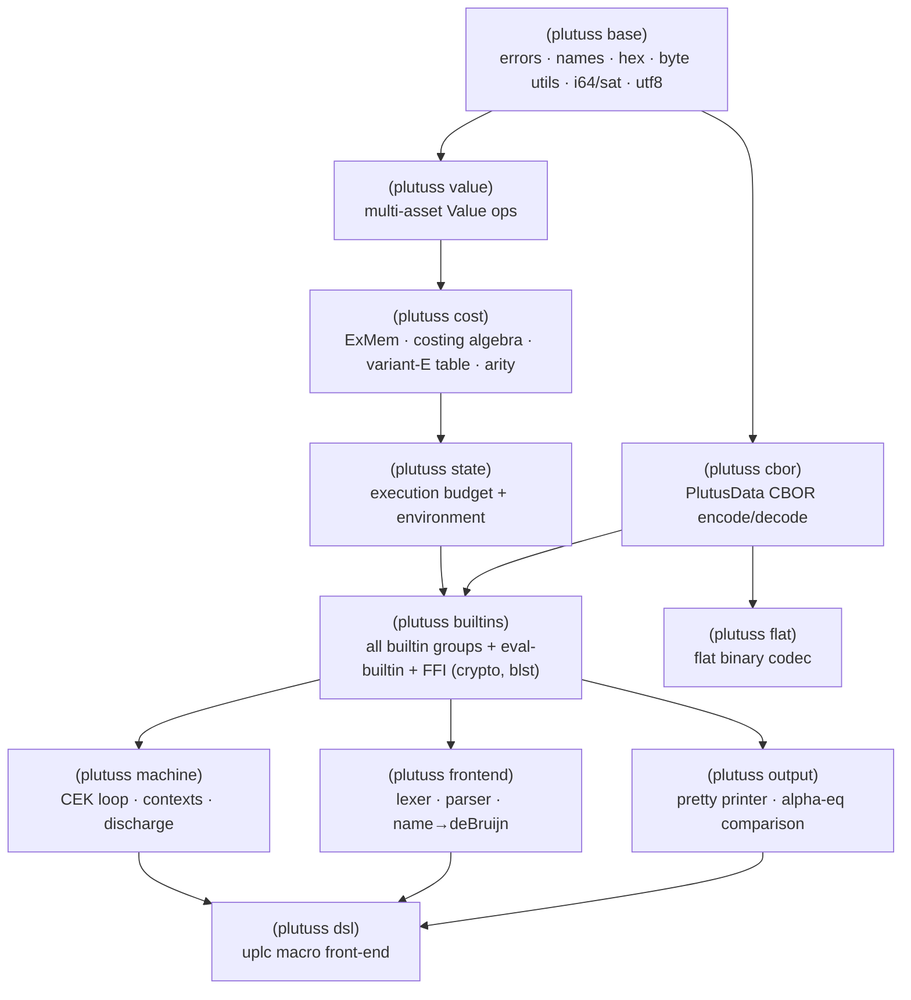

# plutuss

A [UPLC](https://github.com/IntersectMBO/plutus) (Untyped Plutus Core) CEK machine
implemented in **Chez Scheme**, structurally equivalent to the Zig reference
[`utxo-company/plutuz`](https://github.com/utxo-company/plutuz).

It is a parser, CEK-machine evaluator, exact cost-model accountant, and pretty
printer for UPLC. It passes the **entire** IntersectMBO
[`plutus-conformance`](https://github.com/IntersectMBO/plutus/tree/master/plutus-conformance)
UPLC evaluation suite — **999/999 tests on both the result term (alpha-equivalence)
and the exact execution budget** (cpu + memory).

## Results

```
TOTAL=999  result-pass=999  full-pass(result+budget)=999
```

- 449 success tests — output term matches up to alpha-equivalence, and consumed
  `cpu`/`mem` match the golden budget exactly.
- 440 `evaluation failure` tests — evaluation fails as expected.
- 110 `parse error` tests — input is rejected at parse time as expected.

The cost model is the Cardano **cost-model variant E** (`DefaultFunSemanticsVariantE`),
which is what `defaultCostModelParamsForTesting` selects and what the conformance
budget golden files were generated with. The full builtin cost table
(`src/plutuss/cost-table.ss`, used by `(plutuss cost)`) is auto-generated
verbatim from `builtinCostModelE.json`.

## Requirements

- [Chez Scheme](https://cisco.github.io/ChezScheme/) 10.x
- `libsodium`, `openssl@3`, `secp256k1` (Homebrew on macOS) — for SHA-256, BLAKE2b,
  Ed25519, ECDSA/Schnorr secp256k1
- `blst` — built locally by `./build-blst.sh` (for BLS12-381)

Crypto strategy: full native FFI to `libsodium` (SHA-256, BLAKE2b, Ed25519),
`libsecp256k1` (ECDSA + Schnorr), and `blst` (all BLS12-381 G1/G2/pairing ops).
`keccak-256`, `sha3-256`, and `ripemd-160` are pure-Scheme (no clean library
exposes Ethereum-padding Keccak or OpenSSL-3-legacy RIPEMD-160 without provider
juggling).

## Build & run

```sh
./build-blst.sh                          # build blst/libblst.dylib once

# Evaluate a program (prints the result, or `evaluation failure` / `parse error`)
chez --script plutuss.ss program.uplc
chez --script plutuss.ss -b program.uplc   # also print consumed budget
chez --script plutuss.ss -p program.uplc   # pretty-print only, no eval

# Flat (binary on-chain) codec
chez --script plutuss.ss -f program.uplc   # encode to flat, print as hex
chez --script plutuss.ss -u script.flat    # decode a .flat file to textual UPLC

# Run the full conformance suite (expects the plutus repo cloned at ./plutus)
git clone --depth 1 https://github.com/intersectMBO/plutus.git
chez --script tools/conf.ss                  # 999/999
chez --script tools/conf.ss /builtin/semantics/addInteger   # a subset
```

## Syntax DSL (build ASTs from Scheme, no string parsing)

`(plutuss dsl)` is a macro front-end: where `(plutuss frontend)` tokenizes and parses a
*string*, the `uplc` macro builds the very same named AST directly from
s-expression syntax at macro-expansion time. UPLC's textual grammar is already
list-shaped, so it maps almost 1:1 (and Chez reads `[f a]` as `(f a)`, so the
application brackets work verbatim):

```scheme
(uplc (lam x [ [ (builtin addInteger) x ] (con integer 1) ]))   ; build a named AST

;; uplc-eval / uplc-run are FUNCTIONS over a built term:
(uplc-eval (uplc [ [ (builtin addInteger) (con integer 2) ]
                   [ [ (builtin multiplyInteger) (con integer 3) ] (con integer 4) ] ]))
;; => #(con (int 14))   (evaluates via the CEK machine)

;; build once, evaluate the value:
(define applyadd1 (uplc [ (builtin addInteger) (con integer 1) (con integer 2) ]))
(uplc-eval applyadd1)        ; => #(con (int 3))
(uplc-run  applyadd1)        ; => "(program 1.1.0 (con integer 3))"
```

Because it's a macro, constant values and `constr` tags can be arbitrary Scheme
expressions; `,e` splices a Scheme-built sub-term, and `,@e` splices a Scheme
list of terms into the list-shaped positions (`case` branches, `constr` fields,
application arguments — and `List`/`Map`/`Constr` data elements):

```scheme
(uplc (con integer (* 6 7)))                       ; 42
(uplc (con data (Constr 0 (I 1) (B (hex "ab")))))  ; data literals
(uplc (con (pair integer bool) (42 #t)))           ; pair / list constants
(let ((t (uplc (con integer 42)))) (uplc [ (lam x x) ,t ]))
(let ((branches (list (uplc (lam x x)))))
  (uplc (case (constr 0 (con integer 7)) ,@branches)))
(uplc (con data (Constr 0 ,@(map (lambda (n) (list 'I n)) '(1 2 3)))))
(uplc (lam ,(gensym->unique-string (gensym)) (con unit ())))  ; computed binder name
```

Entry points: `(uplc term)`, `(uplc-program (maj min pat) term)`, `(uplc-eval term)`,
`(uplc-run term)`. Every construct produces an AST alpha-equivalent to the
string parser's output, so it feeds the same `name->debruijn` + CEK pipeline.

## Flat (binary) codec

`(plutuss flat)` implements the bit-level **flat** serialization defined by the
Plutus Core specification — the on-chain encoding for Plutus scripts. It encodes
de-Bruijn programs MSB-first: 7-bit-chunked naturals, zigzag-encoded integers,
byte-aligned 255-byte-chunked byte arrays, 4-bit term tags, 7-bit builtin tags,
bit-prefixed type-tag/term lists, and a `0…01` filler. `data` constants are
nested CBOR (`serialiseData`-compatible encode + a full PlutusData CBOR decoder).

It is validated three ways:

- The reference byte vectors (`(error)` → `01000061`, `(con unit ())` →
  `0100004981`, `(builtin addInteger)` → `0100007001`, `(con integer 42)` →
  `010000481501`) all match.
- **All 78 real Cardano mainnet `.flat` scripts** bundled with plutuz decode and
  **re-encode byte-for-byte identically**.
- Every flat-serialisable conformance program round-trips
  `text → deBruijn → flat → deBruijn` up to alpha-equivalence (763/763; the rest
  hold non-serialisable constant types — BLS elements, arrays, Values — which the
  reference encoder rejects too). Zero codec mismatches.

## Pipeline



The runner `tools/conf.ss` replicates the official `compareAlphaEq`: it parses
both the produced and expected programs to de-Bruijn terms and compares
structurally (ignoring binder names), and compares the budget exactly.

## Module structure

The implementation is a set of R6RS libraries under `src/plutuss/`, with an
aggregate `(plutuss)` (`src/plutuss.ss`) that re-exports the public API.
There is no `(load …)`: callers set the library directory and import:

```scheme
(import (chezscheme))
(library-directories (list "src"))
(import (plutuss))        ; or import individual sub-libraries
```



The builtin groups (arithmetic/bytestring/string/list, data, bitwise, value,
crypto, BLS) live inside `(plutuss builtins)` so they share helpers without a
mutable global dispatcher; `eval-builtin` composes them with explicit `or`.

## Notes on tricky conformance details

- **Cost model = variant E.** Several builtins differ from older variants — e.g.
  `divideInteger`/`modInteger` use `above_and_below_diagonal` with `c11=960`, and
  the Value builtins have distinct params. The whole table is generated from the
  JSON so it stays exact.
- **String size measure.** Cost-relevant string arguments use
  `TextCostedByByteLength`: the size is `utf8_byte_length quot 4`, not character or
  byte count.
- **`shiftByteString` / `rotateByteString`** fail (evaluation failure) when the
  shift amount does not fit in a signed `Int64`.
- **BLS scalars** for `scalarMul` / `multiScalarMul` are bounded to 4096 bits
  (64 words); out-of-range scalars are an evaluation failure.
- **`unValueData`** strictly validates sorted, non-zero, non-empty, ≤32-byte keys.
- **Budget arithmetic** uses saturating i64 ops; the consumed budget is clamped to
  `maxBound :: Int64` per dimension, matching the reference.
```
